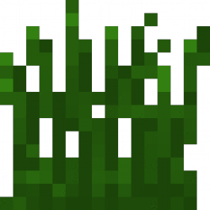

# touch-grass-reminder

  
  

 

A client-side quilt mod which warns players when they have been excessively playing Minecraft, to go outside and touch grass. [Studies](https://www.health.harvard.edu/blog/the-health-effects-of-too-much-gaming-2020122221645)
have shown the negative impacts of excessive gaming on the brain.

# Features
- Configurable reminder frequency.
- Togggleable mod functionality.
- Modmenu integration.

##### This mod was inspired by a [recurring joke](https://github.com/CompeyDev/touch-grass-reminder/assets/74418041/a6bbc222-e24e-4b01-a5ae-3645e9080570) in the modrinth discord. lol!
